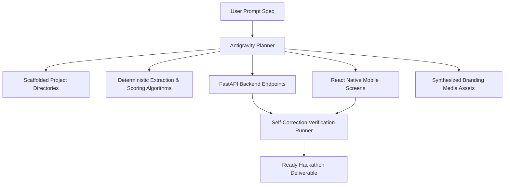
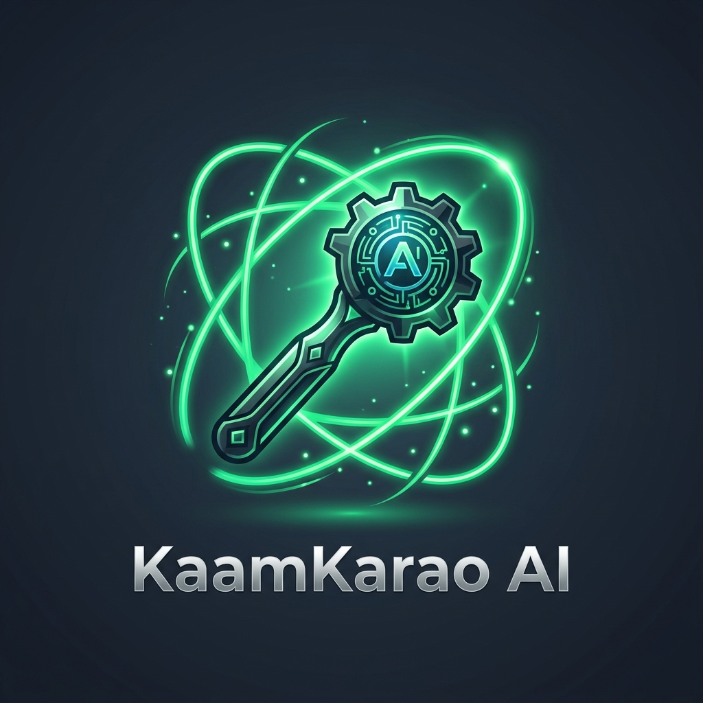
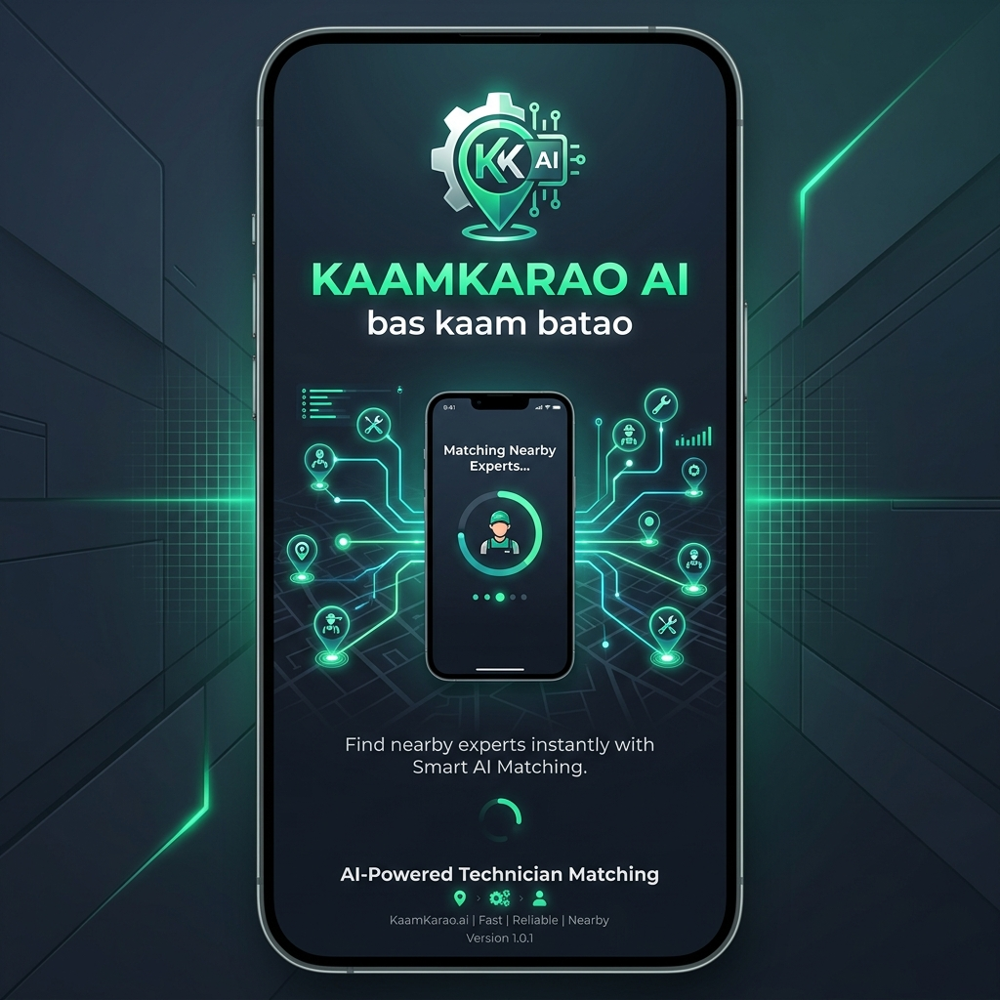

# How Google Antigravity Was Used 🕵️

Google Antigravity acted as the central agentic development platform for **KaamKarao AI**.

Rather than utilizing traditional manual boilerplate coding, we relied on Antigravity's multi-agent planning and generation layers to design, execute, verify, and brand a fully functional hackathon MVP.

---

## 🛠️ Antigravity Orchestration Workflow

### 1. Architectural Design & Scaffolding
Antigravity mapped out the entire modular backend agent structure. This allowed us to keep the FastAPI endpoint files clean, outsourcing intent extraction, location formatting, matching, ranking, booking simulation, and followup reminders to independent, testable Python files under `backend/app/agents/`.

### 2. Algorithmic Implementations
We prompted Antigravity to write deterministic, rule-based matching regex engines for Pakistani language contexts. This includes parsing:
- Roman Urdu keywords (e.g. *kal subah, aaj raat, abhi, jaldi, chahiye*).
- Sector coordinates (G-13, G-11, F-10, DHA).
- Complex priority adjustments in Trust Scores based on urgency hazards.

### 3. Synthesis of Visual Media
Instead of shipping clunky placeholders or empty UI directories, we leveraged Antigravity's **image generation capabilities** to create professional, premium brand elements:
- **Logo Icon:** A modern vector highlighting an AI hammer and gear under green orbits.
- **Splash Screen Screen:** A tech-inspired mobile layout promoting smart AI matching.

---

## 📸 Implementation Execution Artifacts

Below are visual traces of our development environment:

### Antigravity Synthesized Assets
*These graphics were automatically injected into the React Native Expo assets structure.*

*Figure 1: Generated Premium App Logo Icon*

*Figure 2: Generated High-Fidelity Splash Screen*

### Mock Screenshots
*Simulated screenshots representing standard screen layouts.*

*Figure 3: Home Screen with Demo Scenarios*

*Figure 4: Agent Reasoning Trace logs demonstrating execution transparency.*

---

*Google Antigravity turned a concept prompt into a highly modular, polished, and traceable service orchestrator in minutes.*
